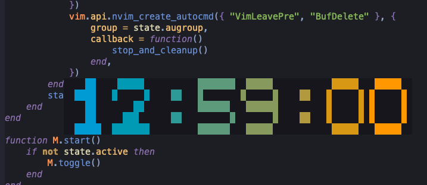

# basic clock

A simple floating clock for Neovim.


## Installing with lazy.nvim

Add the following to your ~/.conf/nvim. Toggle the clock on/off with `<leader>ck`.

```
return {
	"nd70/clock.nvim",
	cmd = "ClockFloatingToggle",
	keys = {
		{
			"<leader>ck",
			function()
				require("clock").toggle()
			end,
			mode = "n",
			desc = "Toggle large floating clock",
		},
	},
	config = function()
		require("clock").setup({
			map = false,
			fg = "#7CFF57", -- bright green
			shadow_fg = "#003300", -- dark green (used only where visible)
			winblend = 0, -- main fully opaque
			shadow_winblend = 5, -- tiny blend so the shadow is subtle
			scale = 1,
			padding = 1,
		})
	end,
}
```
